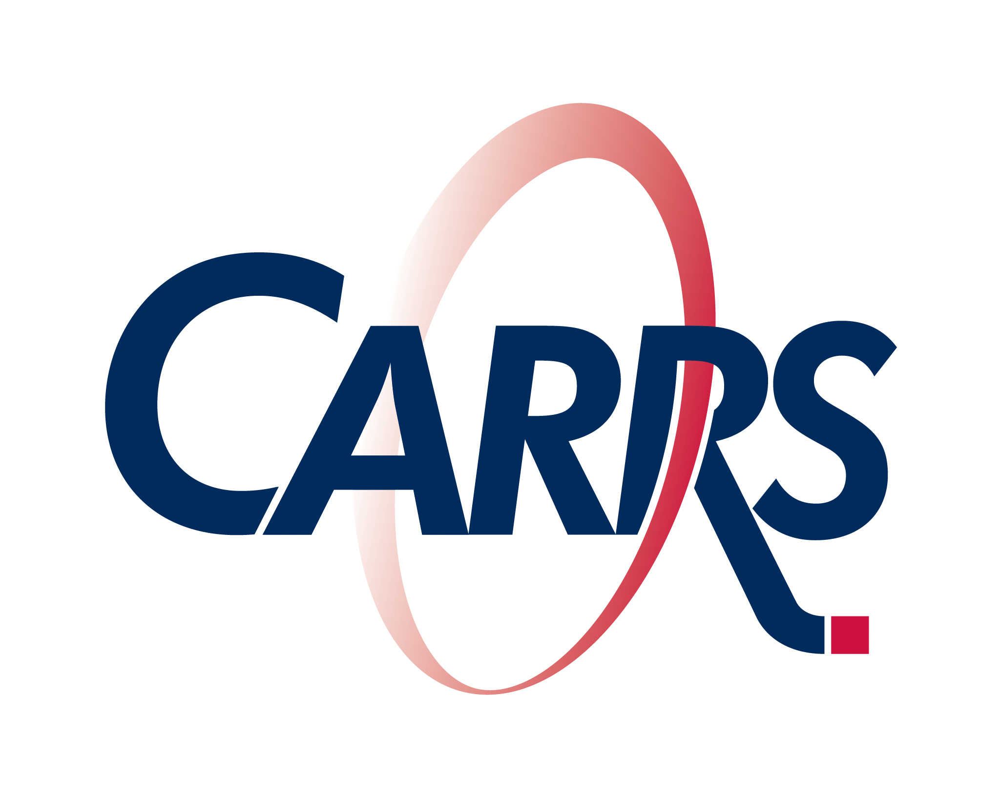

# CARRSQ_MindBridge: Specializing Cross-Subject Brain Decoding for Road Scene Understanding



[Rémi Moustamsik Billah](https://remi-moustamsik.github.io/home/), [Collaborators], [CARRSQ, QUT]

## Overview
![method]

> CARRSQ_MindBridge is an extension of **[MindBridge](https://github.com/littlepure2333/MindBridge/)**, adapted for the specialization of **visual reconstruction of road scenes** from brain signals (fMRI).
> 
> The goal is to assess whether a brain decoding model, originally designed for general-purpose visual reconstruction, can be fine-tuned to detect, reconstruct, and interpret **road safety-specific elements**, such as:
> - the presence of pedestrians, cyclists, or specific vehicles
> 
> This project investigates:
> 1. **Thematic specialization** – adapting a cross-subject model to images from driving contexts.
> 2. **Robustness** – evaluating generalization to new subjects with limited data.
> 3. **Relevance for road safety** – analyzing the ability to reconstruct critical details for decision-making.

---

## Installation

1. Clone this repository:
```bash
git clone https://github.com/remi-moustamsik/CARRSQ_MindBridge.git
cd CARRSQ_MindBridge
```

## Project Structure

The project is organized into three main directories:

- **MindBridge** – contains the code for training new subjects and performing image reconstruction, adapted from the original MindBridge project.
- **data_prep** – scripts and utilities to format the data so it can be used by MindBridge.
- **data_viz** – tools for visualizing the different types of data used in the project.

Les donnees sont uniquement disponibles sur le disque dur fourni.